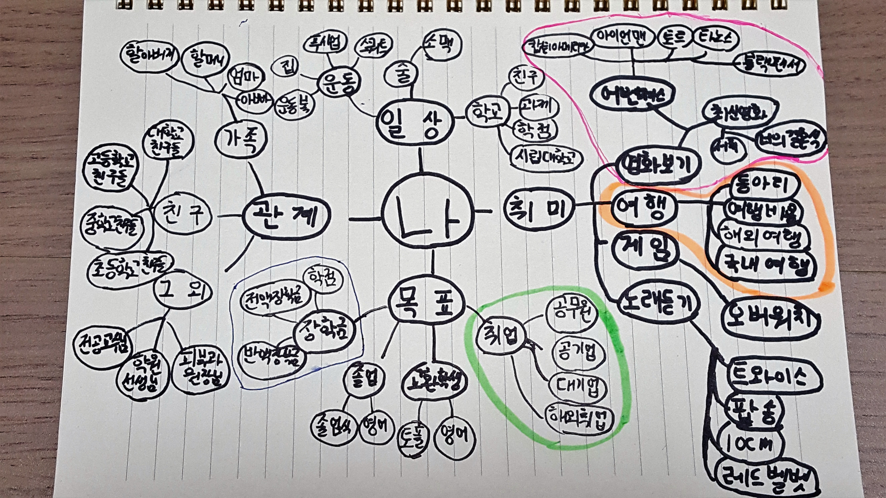

# Me Mind Map

## 목록
[1. 취미](#1) 
[2. 일상](#2) 
[3. 관계](#3) 
[4. 목표](#4) 

<h2 id="1"> 취미 </h2>

> ### 영화보기
- 최신영화 
  - [서치](https://movie.naver.com/movie/bi/mi/basic.nhn?code=172425), [너의 결혼식](https://movie.naver.com/movie/bi/mi/basic.nhn?code=140652)
- [어벤져스](https://movie.naver.com/movie/bi/mi/basic.nhn?code=136315)
  - [캡틴아메리카](https://www.marvel.com/characters/captain-america-steve-rogers), [아이언맨https://www.marvel.com/characters/iron-man-tony-stark), [토르](https://www.marvel.com/characters/thor-thor-odinson), [타노스](https://www.marvel.com/characters/thanos), [블랙팬서](https://www.marvel.com/characters/black-panther-t-challa)

> ### 여행
  - 동아리, 여행비용, 해외여행, 국내여행

> ### 게임
- [오버워치](https://playoverwatch.com/ko-kr/)
> ### 노래듣기
- 트와이스, 팝송, 10cm, 레드벨벳
 
 <h2 id="2"> 일상 </h2>
 
> ### 학교
- [시립대학교](http://www.uos.ac.kr/main.do), 학점, 과제, 친구
> ### 술
- 소맥
> ### 운동
- 스쿼트, 푸쉬업, 집, 운동복

<h2 id="3"> 관계 </h2>

> ### 가족
- 할아버지, 할머니, 어머니, 아버지
> ### 친구
- 대학교 친구들, 고등학교 친구들, 중학교 친구들, 초등학교 친구들
> ### 그 외
- 교수님들, 학원 선생님, 피부과 원장님

<h2 id="4"> 목표 </h2>

> ### 취업
- 공무원
  - *에듀윌*
- 공기업
- 해외취업 
- 대기업

> ### 교환학생
- 영어, 토플

> ### 졸업
- 졸업식
- 영어

> ### 장학금
- 학점
- 전액장학금
- 반액장학금

> 
